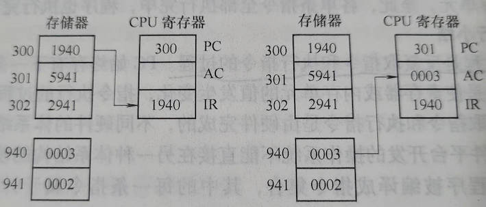

# 第一章 操作系统简介

## 第一节 什么是操作系统

操作系统（Operating System，OS）是一种复杂的系统软件，是不同程序代码、数据结构、数据初始化文件的集合，可执行。

操作系统提供计算机用户与计算机硬件之间的接口，并管理计算机软件和硬件资源。

操作系统是覆盖在裸机上的第一层软件，编译程序、数据库管理系统及其他应用程序都运行在操作系统之上，操作系统为这些软件提供运行环境。

### 一、用户与硬件之间的接口

接口是两个不同组成部分的交接面，分为硬件接口和软件接口。

计算机的所有功能最终都是由硬件的操作实现的。

应用程序是在操作系统上运行的，而对硬件的控制过程都封装在操作系统的核心程序中了。

有操作系统对硬件的抽象，而且操作系统为应用程序提供了运行环境，所以在操作系统上编写和运行应用程序就简单多了。

操作系统屏蔽了对硬件操作的细节，提供了计算机用户与计算机硬件之间的接口，并且通过这个接口使应用程序的开发变得简单、高效。

操作系统必须完成的两个主要目标如下：

1. 与硬件部分相互作用，为包含在硬件平台上的所有底层可编程部分提供服务。
2. 为运行在计算机系统上的应用程序（即所谓用户程序）提供执行环境。


### 二、资源的管理者

现代计算机系统的一个重要特点是支持多任务，即允许在同一个系统内同时驻留多个应用程序。

多个应用程序共同使用计算机硬件和软件资源时，就需要操作系统对这些资源进行有效的管理。

操作系统的主要功能：

#### 1. 处理机管理

程序的执行必须依靠处理机，任意时刻处理机都只能执行一个程序流。

在单处理机系统中执行多个程序流，必须由操作系统的处理机调度程序来管理处理机的分配，以使多个程序共享处理机，从宏观上看多个程序能同时顺利执行。

#### 2. 内存管理

在多任务系统中，内存不再是独占资源，而是可能被多个应用程序共同占用。如何为应用程序分配内存并使不同应用程序的地址空间互不干扰，如何在程序执行完成后回收其所占内存，以及完成逻辑地址到物理地址的转换，都是操作系统内存管理程序要完成的功能。


#### 3. 设备管理

设备管理主要完成接受用户的I/O请求、为用户分配I/O设备、管理I/O缓存和驱动I/O设备等功能。

#### 4. 文件管理

计算机系统把大量需要长时间保留的数据信息以文件的形式存放在外存储设备中（如硬盘、光盘、磁带和U盘），操作系统通过自己的文件管理程序完成外存空间的分配、回收、文件的按名存取、文件的组织、共享与保护等功能。

## 第二节 操作系统的发展

操作系统的发展从时间顺序上经历了从无操作系统到单道批处理系统、多道程序系统（多道批处理系统、分时系统）的发展过程。

### 一、无操作系统

第一代计算机（1945～1955年）使用电子管作为主要的电子器件，用插件板上的硬连线或穿孔卡片表示程序，没有用来存储程序的内存，无操作系统。

### 二、单道批处理系统

第二代计算机（1955～1965年）使用的主要电子器件是晶体管，开始使用磁性存储设备，内外存容量增加，计算机运行速度提高，出现了早起的单道批处理系统。

### 三、多道程序系统

早期多道程序系统不具有交互功能，被称为多道批处理系统。程序员提交作业后，在作业运行结束、输出结果之前，无法观察和控制作业的运行。

解决这一问题的需求非常迫切，于是出现了分时操作系统。

在分时操作系统的支持下，多个用户可以同时通过不同的终端使用主机，主机可以快速响应常用命令。

使终端用户感觉自己独占计算机资源，并且实现用户与主机的及时交互。

在分时操作系统中同时登录系统的多个用户提交的作业轮流执行，每个作业都是运行一小段时间就把主机资源让给另一个作业运行一段时间，多个作业交替执行，分时使用主机资源。

### 四、微机操作系统

随着个人计算机的出现，微机操作系统应运而生。第一个微机操作系统是Intel公司的CP/M系统，用于Intel 8080。

20世纪80年代形成了新DOS版本MS-DOS。

1985年微软开始构建Windows操作系统。

另，还有Linux、Mac OS等一些支持个人计算机的操作系统。

### 五、实时操作系统

随着计算机的广泛应用，出现了各种实时操作系统。实时操作系统是支持实时计算的系统。

实时操作系统不仅要求系统正确地计算出结果，而且要求必须在规定的时间内计算出正确结果。

如果计算结果正确，但时间超过了规定时间，依然被认为计算出错。

### 六、批处理系统、分时系统、实时系统的特点

#### 1. 单道批处理系统的特点

##### 1）自动性

单道批处理系统是计算机能够在操作系统控制下，自动地将作业从外存装入内存运行。当作业运行完毕后，自动撤销已运行完毕的作业，并依次从外存装入下一个作业，使之运行。

##### 2）顺序性

存放在外存中的作业按顺序依次装入内存运行，先进入内存的作业先运行完毕。


##### 3）单道性

任何时刻内存中只有一道作业。


#### 2. 多道批处理系统的特点

在多道批处理系统中，用户所提交的作业都先存放在外存中并排成一个队列，该队列被称为“后备作业队列”。由操作系统的作业调度程序按一定策略从后备作业队列中选择若干个作业调入内存，使它们共享CPU和系统中的各种资源，以达到提高资源利用率和系统吞吐量的目的。

##### 1）多道性

在内存中可以同时驻留多道程序，当在CPU上运行的作业提出I/O请求后，该CPU可以执行其他作业，从而有效地提高系统资源的利用率和吞吐量。

##### 2）无序性

多个作业完成的先后顺序与它们进入内存的顺序之间没有严格的对应关系。先进入内存的作业不一定被调度，也不一定先被执行完。

##### 3）调度性

多道程序系统必须具有作业调度和进程调度功能。作业调度用来从后备作业队列中选择一个或多个要被装入内存的作业。进程调度程序用来从内存中选择一个（单CPU系统）或多个（多CPU系统）进程，使其在CPU上运行。

##### 4）复杂性

#### 3. 分时系统的特点

分时操作系统允许多个用户通过终端同时使用计算机。

分时操作系统是多道程序系统的自然延伸，支持多用用户任务同时驻留内存，每个用户通过终端与主机交互时都能得到快速响应。

分时系统的特点是多路行、独立性、及时性和交互性。

分时系统的优点是向用户提供了人机交互的方便性，使多个用户可以通过不同的终端共享主机。

#### 4. 实时系统的特点

实时系统主要用于实时控制和实时信息处理领域。

实时系统必须能及时响应外部事件的请求，在规定时间内完成对该事件的处理，并控制所有实时任务协调一致地运行。

##### 1）多路性
##### 2）独立性

每个终端用户在向实时系统提出服务请求时，是彼此独立操作，互不干扰。

##### 3）及时性

实时信息处理系统对实时性的要求是以人所能够接受的等待时间来确定的。

##### 4）交互性
##### 5）可靠性


### 七、操作系统产品现状

1. 主机操作系统
2. 服务器操作系统
3. 微机操作系统
4. 嵌入式操作系统

## 第三节 操作系统的特征

现代操作系统都支持多任务，具有并发、共享、虚拟和异步性特征。

### 1. 并发

并发是指两个或多个事件在同一时间间隔内发生。并发强调“同一时间间隔”，与并行是有区别的两个不同的概念，并行是指多个事件同时发生。

### 2. 共享

共享是指系统中的资源可供内存中多个并发执行的进程共同使用。资源共享有两种方式，即互斥共享和同时共享。

### 3. 虚拟

虚拟是指通过某种技术把一个物理实体变成若干逻辑上的对应物。

### 4. 异步性

进程以不可预知的速度向前推进。内存中的每个程序何时执行、何时暂停、以怎样的速度向前推进，以及每道程序总共需要多少时间才能完成等，都是不可预知的。

## 第四节 操作系统的功能

### 一、内存管理

内存管理的主要任务是为多道程序的运行提供良好的环境，方便用户使用内存，提高内存的利用率，以及从逻辑上扩充内存以实现虚拟存储。

#### 1. 内存分配

内存分配的主要任务是为每道程序分配内存空间。

有静态分配和动态分配两种方式：

1. 静态方式：内存划分成固定大小和数量一定的区域，再系统运行过程中各分区的大小和数量不再变化。
2. 动态方式：根据进程的请求分配内存，内存中分区的大小和数量都是动态变化的。

#### 2. 内存保护

一是是操作系统内核的空间不会被用户随意访问，以保证系统的安全和稳定；

二是确保每道用户程序都在自己的内存空间中运行，互不干扰。

#### 3. 地址映射

CPU执行程序过程中访问内存时，需要把程序的逻辑地址转变为物理地址，这个转换的过程称为地址映射。

##### 1）逻辑地址与物理地址

目标程序中的地址称为逻辑地址，从0开始；内存中的单元地址称为物理地址。

CPU访问内存需要将物理地址送入地址总线，以选中要访问的内存单元。

##### 2）地址映射

将逻辑地址转换为对应的物理地址。

#### 4. 内存扩充

内存扩充的任务时借助于虚拟存储技术，从逻辑上扩充内存容量，使系统能够向用户提供比物理内存大的存储容量。

##### 1）请求调入功能

##### 2）置换功能

### 二、进程管理

进程可以被认为是程序的执行实体。

### 三、设备管理

主要完成用户的I/O请求，为用户分配I/O设备。

设备管理的功能：

#### 1）缓冲管理
#### 2）设备分配
#### 3）设备处理

由设备驱动程序来实现CPU与设备控制器之间的通信。

#### 4）设备独立性和虚拟设备

设备独立性功能使应用程序独立于物理设备。

虚拟设备的功能是把一个物理设备变换为多个对应的逻辑设备，使一个物理设备能供多个用户共享。


### 四、文件管理

#### 1. 文件存储空间的管理

为每个文件分配必要的外存空间，提高外存利用率，并能有助于提高访问文件的速度。

#### 2. 目录管理

为每个文件建立目录项并对众多目录项进行有效组织。

#### 3. 文件的读、写管理和存取控制

根据用户的请求，从外存中读取数据或将数据写入外存。防止未经核准的用户存取文件，防止冒名顶替存取文件，防止以不正确的方式使用文件。

### 五、提供用户接口

为了方便用户使用操作系统，操作系统向用户提供了用户与操作系统之间的接口。

#### 1. 命令接口

为了便于用户与计算机系统的交互

##### 1）联机用户接口

这是为联机用户设计的接口，它由一组键盘操作命令和命令解释程序组成。

##### 2）脱机用户接口

脱机用户接口是为批处理作业的用户提供的，也称为批处理用户接口。

#### 2. 图形用户接口

20世纪90年代，在操作系统中开始引入图形化用户接口。

#### 3. 程序接口

操作系统提供给程序员的接口是系统调用。

## 第五节 操作系统的体系结构

### 一、软件体系结构简介

软件体系结构是一个复杂软件系统的高层结构，为软件系统提供了一个结构、行为和属性的高级抽象。

明确清晰的软件体系结构是一条贯穿软件系统整个生命周期的主线，是软件设计成功的基础和关键，也是对软件大型化、复杂化趋势的一种很好的应对决策。

#### 1. 简单的监控程序模型

任意时刻系统中只能运行一个任务，这样保证了对系统信息的互斥访问，保护了系统数据的安全。

#### 2. 单体结构模型

单体结构模型是软件工程出现以前的早期操作系统及目前一些小型操作系统采用的体系结构。在单体结构模型，所有的软件和数据结构都放置在一个逻辑模块中，对外层的用户程序提供一个完整的内核界面-系统调用。

具有单体内核结构的典型操作系统由UNIX系统、MS-DOS、Linux、Mac OS X 和 BSD等系统。

#### 3. 层次结构模型

层次结构的基本思想是将操作系统分解为多个小的、容易理解的层，系统功能被隔离在不同层中，每一层提供对系统功能的部分抽象，然后采用单向调用的顺序，形成一连串彼此连续的对系统功能的“抽象串”，最终形成对整个系统的完成抽象。

#### 4. 客户/服务器模型与微内核结构

把传统操作系统内核中的一些组成部分放到内核之外作为一个独立的服务器进程来实现，在微内核中只保留了操作系统最基本的功能。

目前微内核的操作系统一个是想通用操作系统的方向发展，如Windows NT；另一个就是嵌入式操作系统。

#### 5. 动态可扩展结构模型

动态可扩展结构模型的基本思想是在运行过程中，能够动态实现系统行为扩展的结构，也可称为弹性结构。

## 第六节 指令的执行

程序是指令的集合，程序的执行就是按照某种控制流执行指令的过程。

### 1. 指令周期

一个单一指令需要的处理称为指令周期，一个指令周期可以划分成两个步骤，分别是取指周期和执行周期。

### 2. 取指令和执行指令

#### 1）取指令

在每个指令周期开始时，处理器从存储器中取一条指令。

#### 2）执行指令

取到的指令被放置在处理器的指令寄存器IR中。

### 3. 一个实例

1）程序计数器（PC），存指令地址。

2）指令寄存器（IR），存正在执行的指令。

3）累加器（AC），临时存储体和累加操作。

#### 部分操作码的二进制表示与其对应的操作如下。

1）0001:从内存中读取数据并送入AC。

2）0010:把AC的内容存储到内存中。

3）0101:把从内存中取得的值与AC中的值相加，结果仍存放在AC中。

#### 程序功能

把内存940单元的内容与941单元的内容相加，结果送入941单元。程序的3条指令：

```
move AC,(940); 1940
add AC,(941);  5941
move(941),AC;  2941
```

其中，move表示传送，move AC,(940)指令的功能是将(940)内存单元的值传入累加器AC。对应的操作码为0001。

“;”后面内容为注释信息，1940是move AC,(940)指令对应的机器码。

add AC,(941)指令的功能是将(941)存储单元的内容与累加器AC中的内容相加，再送入AC；对应的操作码为0101.

move(941),AC指令的功能是将AC累加器的内容传送到941号存储单元。对应的操作码为0010。

##### 分析：第一条指令的执行过程



1）程序开始执行时，程序计数器PC的值为move AC,(940)指令对应的机器码1940所在的存储单元的地址300。

2）CPU将1940送入指令寄存器IR，PC值自动加1，变为301。

3）CPU对1940进行译码。

4）操作码为0001时，执行从内存940单元取数送入AC。

5）指令执行结果是把地址为940的内存单元的值3送入AC。

##### 例题

将内存100单元的内容与101单元的内容相加，并将相加的结果传入101单元，请根据程序的功能写出程序对应的指令。（提示：期间需要用到累加器AC）

```
move AC,(100)
add AC,(101)
move (101),AC
```
解析：本题通过累加器AC求和，并将结果送入指定的单元。

### 4. 指令的执行小结

程序执行的过程是反复取指令和执行指令的过程。

## 本章小节

第一章主要介绍了操作系统的基础知识，从操作系统的概念、作用、功能、特征、发展及软件体系结构等方面对操作系统进行了介绍，最后一节介绍了指令的执行过程。


