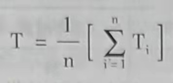
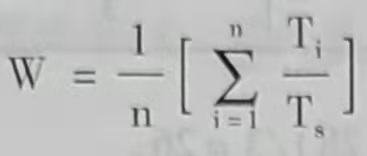

# 第三章 进程调度与死锁

当多个进程在系统中并发执行时，所有进程共享CPU。当某一CPU上运行的进程因阻塞或进程运行结束而使CPU可以分配给其他进程使用时，如何从众多就绪的可运行进程中选择一个进程，将C PU分配给该进程，使系统有效运行，是多任务操作系统必须解决的问题之一。本章介绍进程调度的算法，以及选择进程调度算法的原则。

在多任务系统中，进程共享系统资源，当多个进程竞争有限的共享资源时会发生进程无限阻塞，不能继续运行的僵死状态，即本章所述的进程死锁问题。死锁发生的原因和解决死锁的方式是本章阐述的另一个重要知识点。

## 第一节 进程调度的功能与时机

### 一、进程调度的功能

进程调度功能由操作系统内核的进程调度程序完成，在Liux内核中，进程调度功能的
实现从调用内核函数schedule()开始。进程调度的功能是按照某种策略和算法从就绪态进程
(在Linux中是可执行进程)中为当前空闲的CPU选择在其上运行的新进程。在后续章节中将阐述进程调度的策略和算法。

### 二、进程调度的时机

当一个进程运行结束（包括正常结束和异常结束）、进程阻塞、中断返回、在支持抢占式调度的系统中有比当前运行进程优先级更高的进程到来、当前运行进程的时间片用完时，系统都会通过执行进程调度程序重新进行进程调度。

## 第二节 进程调度算法

进程调度算法是指从就绪态进程中选择一个或几个进程为其分配CPU，使其进人执行态的算法。也就是说进程调度算法要“决定”把CPU分配给就绪队列中的哪个进程。进程调度由操作系统内核中的进程调度程序完成。		

### 一、选择调度方式和算法的若干准则

不同的调度算法有不同的特点，为了根据特殊应用领域的要求选择合适的调度算法，可以下面的准则作为选择依据。

#### 1. 周转时间短

周转时间是指从作业被提交给系统开始到作业完成为止的这段时回间隔。它包括4部分时间：作业在外存后备队列上等待调度的时间，进程在就绪队列上等待进程调度的时间，进程在CPU上执行的时间，以及进程等待I/O操作完成的时间。

对每个用户而言，都希望自己的作业周转时间尽可能短。而计算机系统的设计者和管理者使用平均周转时间和带权平均周转时间来衡量系统的时间性能。

如果系统中有n个作业，系统的平均周转时间T等于n个作业的周转时间之和除以n。其表达式如式(3-1)所示。

作业的周转时间T与系统为它提供的服务时间Ts之比为W，W=T/Ts，被称为带权周转时间，n个作业的平均带权周转时间表达式如式(3-2)所示。

服务时间Ts,是一个作业在CPU上执行的总时间。

#### 2. 响应时间快

响应时间是指从用户提交一个请求开始直至系统首次产生响应的时间为止的一段时间，它包括3部分时间：从输入设备（如键盘、鼠标等）输入的请求信息传送到处理机的时间、处理机对请求信息进行处理的时间，以及将所形成的响应信息回送到终端显示器的时间。对于交互式系统，响应时间是衡量系统时间性能的重要指标。进程调度算法和输入/输出设备的速度都会影响系统的响应时间。

#### 3. 截止时间的保证

截止时间是指某个任务必须开始执行的最迟时间，或必须完成的最迟时间。截止时间是评价实时系统性能的重要指标。在实时系统中，若实时任务的开始截止时间或完成截止时间不能得到保障，实时系统的可靠性就无法保证。因为实时系统计算的正确性不仅取决于计算的逻辑结果的正确性，而且取决于得到计算结果的时间。实时系统必须采取特殊的调度策略和调度算法来满足对截止时间的要求。

#### 4. 系统吞吐量高

吞吐量是指单位时间内完成的作业数。系统的吞吐量是评价系统性能的重要指标之一：调度算法影响系统的吞吐量。

#### 5. 处理机利用率好

CPU是计算机系统中影响时间性能的最重要的硬件资源，在多任务系统中，进程调度算法对CPU的利用率有很大影响。因此，在选择和设计进程调度算法时应该考虑使CPU的利用率尽可能高。

### 二、调度算法

#### 1. 先来先服务调度算法(First-Come,First-Served,FCFS)

##### (1) 调度算法

在进程调度中，FCFS就是从就绪队列的队首选择最先到达就绪队列的进程，为该进程分配CPU。

##### (2) 性能分析

FCFS适合长进程，不利于短进程，短进程等待时间相对运行时间而言太长。FCFS使短进程的周转时间过长，系统的平均周转时间也比较长。FCFS有利手CPU繁忙型进程(如科学计算)，不利于I/O繁忙型进程（如多数的事务处理），考虑以下实例。

有3个进程p1、p2和p3，分别在0、1、2时刻进入系统，需要的运行时间长度分别为24、3、3，如果按FCFS调度算法，3个进程的等待时间和周转时间如表3-1所示。

|进程名|进入系统时间|开始运行时间|服务时间|等待时间|周转时间|
|:-:|:-:|:-:|:-:|:-:|:-:|
|p1|0|0|24|0|24|
|p2|1|24|3|23|26|
|p3|2|27|3|23|28|

系统的平均周转时间T=(24+26+28)/3=26。

平均带权周转时间W=(24/24+26/3+28/3)/3≈6.33。

如果进程进入系统的顺序是p3、p2和p1，3个进程进入系统的时间分别是0、1、2，那么3个进程的等待时间和周转时间则如表3-2所示。

|进程名|进入系统时间|开始运行时间|服务时间|等待时间|周转时间|
|:-:|:-:|:-:|:-:|:-:|:-:|
|p1|2|6|24|4|28|
|p2|1|3|3|2|5|
|p3|0|0|3|0|3|

此种情况下系统的平均周转时间为T=(28+5+3)/3=12。

平均带权周转时间W=(28/24+5/3+33)/3≈1.28。

对比可见，让短进程先运行能显著降低系统的平均周转时间和平均带权周转时间。

#### 2. 短进程优先调度算法(Shortest-Process-First,.SPF)

##### (1) 调度算法

短进程优先(SPF)的调度算法是从就绪队列中选择估计运行时间最短的进程，将处理机分配给它，使它立即执行并一直执行完成，或发生某事件而被阻塞放弃处理机时，再重新
调度。

##### (2) 算法优点

与FCFS算法相比，短进程优先的算法能有效降低进程的平均等待时间，提高系统的吞吐量。

##### (3) 算法的缺陷

1) 对长进程不利。如果系统中不断有短进程到来，长进程可能长时间得不到调度。

2) 不能保证紧迫进程的及时处理，因为该算法不考虑进程的紧迫程度。

3) 进程的长短根据用户的估计而定，并不一定能真正做到短进程优先。

##### (4) 性能分析

从表3-1和表3-2的比较中可以看出短进程优先的调度算法与先来先服务调度算法相比，能降低系统的平均周转时间和带权平均周转时间。

#### 3. 优先权调度算法(Priority-Scheduling Lgorithm)

##### (1) 调度算法

在使用优先权调度的系统中，每个进程都有一个与之关联的优先权。优先权值通常是固
定区间的数字，如0~127中的一个数。系统可能设计为优先权值越大，优先权越高；也可
能设计为优先权值越小，优先权越低。优先权可以通过内部或者外部方式来定义。内部定义
优先权可使用一些可测量数据以计算进程的优先权值。例如，时间极限、内存要求、打开文
件的数量、平均I/O服务时间与平均CPU服务时间之比都可以用于计算优先权。外部优先
权是通过操作系统之外的准则来设置的，如进程的重要性、用于支付使用计算机的费用和数
量等。

当使用优先权调度算法进行进程调度时，系统将CPU分配给就绪队列中优先权值最高
的进程。

##### (2) 优先权调度算法的类型

用于进程调度的优先权调度算法可以分为下列两种类型

1) 非抢占式(Nonpreemptive)优先权调度算法。

在支持非抢占式调度的系统中，高优先权进程一旦得到处理机，则该进程便一直运行下
去，直到完成或由于某事件使该进程主动放弃处理机。在进程运行期间，即使有高优先权进
程到来，系统也不能剥夺当前进程（即正在运行的进程）的CPU使用权。高优先权进程到来
时如果有别的进程正在运行，高优先权进程只能先进入就绪队列。在对截止时间要求严格的
实时系统中，非抢占式调度难以保证高优先权进程得到及时调度。

2) 抢占式(Preemptive)优先权调度算法。

在支持抢占式调度的系统中，如果新到达进程的优先权高于当前正在运行进程的优先
权，那么系统会抢占CPU,把它分配给新到达的高优先权进程，而正在执行的低优先权进
程暂停执行。在抢占式调度算法中，每当系统中出现一个新的就绪进程，就将其优先权与正
在执行的进程的优先权相比较，如果其优先权大于正在执行的进程的优先权，可采用立即抢
占策略，立刻进行进程切换，使其投入运行。也可以采用基于时钟中断的抢占策略，在最近
一次时钟中断到来时进行进程切换。费

##### (3) 优先权的类型

如何确定进程的优先权是实现优先权调度算法的一个关键问题，优先权的计算方法对优。
先权调度算法的性能有很大的影响。根据优先权的变化特点可以将优先权的类型分为静态优
先权和动态优先权。

1) 静态优先权。静态优先权在创建时确定，在进程的整个运行期间保持不变。静态优
先权值通常可以根据进程的类型、进程需要的资源数量和用户的要求来设定

2) 动态优先权。进程创建时被赋予的优先权，随进程的推进或随其等待时间的增加而
改变。动态优先权调度算法可以使系统获得更好的调度性能。

##### (4) 优先权调度算法存在的问题和解决方案

1) 问题。优先权调度算法的一个主要问题是无穷阻塞，或称饥饿(Starving)问题。这里
的阻塞是指就绪态进程因得不到CPU而等待的状态。优先权调度算法会使某个低优先权进
程无穷等待CPU,在一个重负载的计算机系统中，平稳的高优先权进程流可以阻止低优先
权进程获得CPU。据说，MT在1973年关闭BM7094时，发现有一个低优先权进程是于1967年提交但一直未运行的

2) 解决方案、低代先权进程无穷等待间题的解决方案之一是老化(Agg)技术。老化技
术以逐渐增加车系统中等待时回银长的进程的优先权，使低优先权进程在等待时间很长的情
况下，优先权变高而获得C卫执行

#### 4. 时间片轮转调度算法(Round--Robin,RR)

时间片轮转调度算法是在现代分时系统中广泛使用的进程调度算法，UNIX、Liux和
Windo操作系统郑采用基于时间片纶钱、支持优先权和抢占式调度的混合式进程调度
算法。

##### (1) 时间片轮转调度算法

在早期的时间片轮转调度算法中，系统将所有的就绪进程按先来先服务的原则，排成
个队列，每次调度时把CPU分配给队首进程，并令其执行一个时间片。当时间片用完时，
调度程序终止当前进程的执行，并将它送到就绪队列的队尾。时间片是一个较小的时间单
元，通常为10~100ms。Linux2.4内核给用户进程分配的时间片大小一般为50ms。

在采用时间片轮转调度算法的系统中，进程需要在CPU上运行的时间总数（这里称之为
时间区间)可能小于一个时间片，也可能大于一个时间片。对于进程的时间区间小于一个时
间片的情况，进程在CPU上运行结束后，进程本身会自动释放CPU。然后，由操作系统执
行进程调度程序为另一个就绪进程分配CPU。对于进程的时间区间大于一个时间片的情况
进程可能需要执行若干个时间片。每当进程在CPU上连续运行的时间等于一个时间片长度
时，操作系统在时钟中断处理过程中会抢占CPU,进行进程切换，用新的就绪进程替代当
前进程，被替换的当前进程重新回到就绪队列中。

##### (2) 时间片大小的确定

在设计时间片轮转调度算法时，时间片大小的确定是一个重要的环节。时间片太长，可
以使多数进程在一个时间片内处理完，能够降低进程的周转时间，但是可能造成交互用户的
响应时间过长。时间片太短，一个进程要经过多次调度运行才能执行完毕，进程切换和进程
调度的开销会增加，系统的平均周转时间也会比较长。例如，假定进程切换需要10s,如
果时间片也是10s,那么，CPU至少把50%的时间花费在进程切换上。因此，要根据用户
和系统的需要选择大小合适的时间片。选择时间片时既要考虑交互用户的需求，也要平衡系
统的效率。在为调度程序确定时间片的大小时，通常要考虑以下几个因素。

1) 系统对响应时间的要求。响应时间是分时系统性能的重要指标，设计时间片大小时首先要考虑其对响应时间的影响和系统对响应时间的要求。系统响应时间为T,进程数目为
N,时间片为4，有T=4,也就是说响应时间与进程数和时间片成比例。因此在系统允许
的最大进程数一定的情况下，时间片的长短取决王系统要求的响应时间。响应时间越短，时
间片取值应该越小。

2) 就绪队列中进程的数目。在分时系统中，系统允许的最大进程数往往是给定的，系
统中的进程数会影响系统的响应时间，进程越多，响应时间越长。但是，操作系统的设计者
希望系统的响应时间有一个上限值，不能出现因为进程多而使系统响应时间很长的情况。当
设定了系统的最长响应时间值后，一时间片的大小就与系统允许的最大进程数成反比。

3) 系统的处理能力。系统的处理能力是必须保证系统支持的基本命令能在一个时间片
内执行完，否则将无法保证得到满意的响应时间，而且会使平均周转时间及带权周转时间都
很长。

##### (3) 时间片轮转调度算法的性能评价

时间片轮转调度算法的性能很大程度上依赖于时间片的大小。在极端情况下，如果时间
片很大，那么时间片轮转调度算法就与先来先服务算法一样（如果就绪队列按先进先出对进
程排序)。如果时间片很小，进程需要经过多次上下文切换和进程调度，会大大增加CPU用
于进程切换和进程调度的开销。

#### 5. 多级队列调度

在现代操作系统中，进程可以根据不同的特点进行分类，每一类进程属于一个就绪队
列。因此，系统中的就绪队列往往不止一个而是多个，这种系统通常根据不同进程对响应
时间要求的不同，采用多级队列调度算法。

##### (1) 多级队列调度算法(Multilevel Queue-Scheduling Algorithm)
将就绪队列分成多个独立队列，根据进程的某些属性，如需要占用的内存大小、进程优
先权或进程类型，进程会被永久地分配到一个队列。每个队列有自己的调度算法。不同的队
列优先权不同，调度算法也可能不同。

##### (2) 多级队列调度算法应用举例

多级队列调度举例：Miiⅸ操作系统的进程调度。

Miix把进程按类型不同分为3类，分别对应3个优先权不同的就绪队列：优先权最高
的任务进程队列、优先权次之的服务进程队
列和优先权最低的用户进程队列。对任务进
程和服务进程采用基于优先权的非抢占式调
度，优先权高的进程一旦获得处理机将一直
运行下去，直到阻塞。对优先权最低的用户
进程采用时间片轮转的抢占式调度。

调度程序按如图3-1所示的流程完成进
程调度

#### 6. 多级反馈队列调度

采用多级队列调度，一旦进程进入系
统，就被固定地分配到一个就绪队列中，进
程在被撤销前不会在不同队列之间移动。这
种算法的优点是降低了进程调度的开销，但
是不够灵活，对低优先权进程会存在无穷阻塞（饥饿）问题。而多级反馈队列调度算法(Ml-
tilevel Feedback Queue Scheduling)可以弥补这些不足。

在采用多级反债队列调度的系统中建立多个优先权不同的就绪队列，为每个队列赋予大
小不同的时间片。有一种反馈策略可以规定：队列优先权越高，时间片越短，时间片通常成
倍增长。新进程被创建后，先插人优先权最高的队列，仅当高优先权队列空时，才调度优先
权次之的队列。同一队列中，采用时间片轮转调度算法。使用CPU时间过多的进程会被移
到优先权较低的队列中，在较低优先权队列中等待时间过长的进程会被转移到较高的优先权
队列中。这样就通过使用老化技术阻止了饥俄的发生。但是，不可的莱作杀统在设计多级反
馈队列调度时采取的策略可能是不同的。多级反馈队列算法的设计要考虑以下几个方面的问题。

1) 就绪队列的数量。

2) 根据进程代生权确定进程应该迷人即个就绪队列的算法。

3) 用以确定进程包时转移到较高代先权队列的算法。

4) 用以确定进程时转移到较低优先权队列的算法。

5) 用以确定进程在需要眼务时应该进人哪个队列的算法。

多级反馈认列调度算法的一个典型实例是、261I内传的进程调度算法。