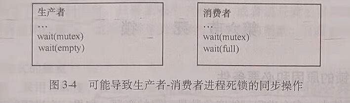
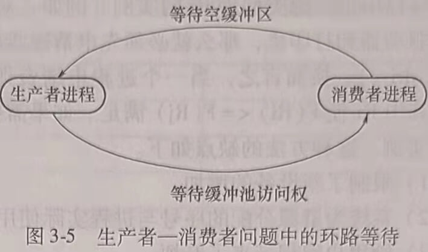
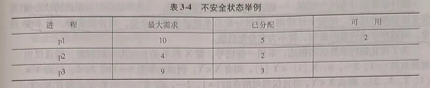
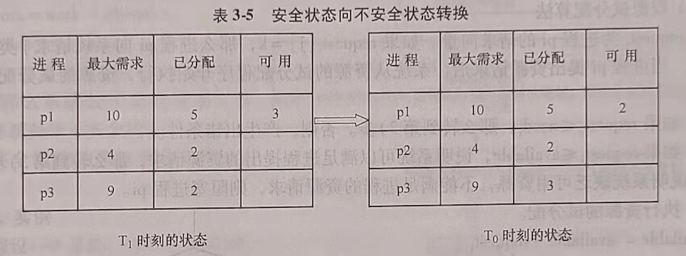
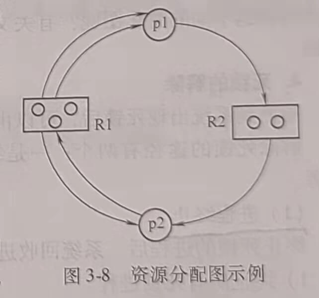
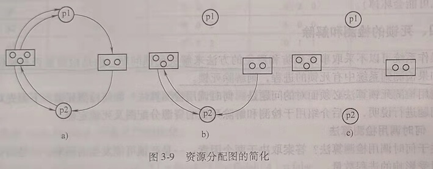

## 第六节 死锁

### 一、产生死锁的原因和必要条件

在多道程序系统中，多个进程可能竞争数量有限的资源。如果一个进程所申请的资源被其他处于阻塞状态的进程占有，该进程就会因为不能获得所申请的资源而被阻塞。若此时该进程恰好又占有了前述其他进程所需要的资源，那么这一组进程就可能因为等待释放自己所需要但被其他进程已占有的资源而无法向前推进。这种由于多个进程竞争共享资源而引起的进程不能向前推进的僵死状态称为死锁。

#### 1. 产生死锁的原因

进程访问资源是通过执行程序实现的。一般来说，进程按照申请资源、访问资源和释放资源的顺序使用资源。产生死锁的原因为：竞争共享资源且分配资源的顺序不当。

#### 2. 产生死锁的必要条件

死锁产生时，必须同时满足下列4个条件。

##### (1) 互斥条件

指一个进程在访问资源的过程中，其他进程不能访问该资源。如果一个资源正在被访问时，有其他进程也提出对该资源的访问请求，必须把请求该资源的进程阻塞起来，直到资源被进程释放。

##### (2) 请求和保持条件

进程已经保持了至少一个资源，又提出了新的资源要求，而新请求的资源已经被其他进程占有，此时进程阻塞，但又对已经获得的资源保持不放，使得其他进程无法使用被保持的资源。举例说明：进程P1获得了资源A的访间权，然后又请求资源B。但是资源B因为被别的进程占用而无法分配给进程p1。通常，操作系统会把p阻塞起来，插入资源B的等待队列中。p1被阻塞却没有释放对资源A的访问权。这时就出现了p1请求资源B而保持资源A的条件。

##### (3) 不剥夺条件

进程已经获得的资源不能被剥夺，只能由进程自己释放。例如，进程p1获得了资源A的访问权，进程p2再申请访间资源A，即使进程p1因为某种原因被阻塞，暂时不需要使用资源A,进程p2也不能通过系统剥夺资源A的访问权，只能等待进程p1释放对资源A的访问权。

##### (4) 环路等待条件

在发生死锁时，必然存在一个进程申请资源的环形链。即进程集合p0,p1,p2···，pn中的pO正在等待一个p1占用的资源；p1正在等待p2占用的资源，···，pn正在等待已经被pO占用的资源。

注意：只有当上述4个条件同时满足时才会发生死锁。

#### 3. 实例

下面以生产者和消费者问题为例，说明产生死锁的必要条件，如图3-4所示。

如果生产者和消费者进程都先通过执行wait(mutex)申请公共缓冲池的互斥访问权，当缓冲池满且生产者和消费者进程几乎同时访问公共缓冲池时，可能发生死锁，出现4个必要条件同时满足的情况。

1) 互斥条件。若生产者进程先占用公共缓冲池访问权，消费者请求缓冲池访问权时会被阻塞。即缓冲池访问权只能被任意两个进程中的一个所占有。所有的生产者进程和消费者进程对公共缓冲池的访问是互斥的。

2) 请求和保持条件。生产者进程获得缓冲池使用权后，又提出申请空缓冲区的请求。因为缓冲池装满了消息，没有空缓冲区。因此，生产者进程无法获得空缓冲区资源而被阻塞，但生产者进程仍保持缓冲池的访问权。

3) 不剥夺条件。虽然缓冲池中有消费者进程需要的消息资源，只要消费者进程能够获得缓冲池的互斥访问权就可以执行取消息的操作，但消费者进程不能剥夺生产者已获得的缓冲池访问权。

4) 环路等待。存在生产进程等待消费者进程释放空缓冲区，消费者进程等待生产者进
程释放公共缓冲池互斥访问权的资源申请环路，如图3-5所示。

### 二、处理死锁的基本方法

处理死锁的基本方法有预防死锁、避免死锁、检测并解除死锁和忽略死锁问题（即假定死锁不可能在系统内发生而忽略死锁)。

为确保不发生死锁，操作系统可以采用死锁预防或死锁避免方案。

#### 1. 死锁的预防

死锁预防是根据前面讨论的死锁必要条件，通过保证至少其中一个条件不成立来达到预防发生死锁的目的。

由于有些共享资源必须被定义为临界资源，对于这些资源的访问必须是互乐的。因此，对这类资源的访问不能通过摒弃互斥条件来预防死锁的发生，如对打印机的访问。但是，有些共享资源是允许进程同时访问的，
如允许进程同时读一个共享文件。如果进程访问的都是这些资源，是不会出现死锁问题的。在操作系统中无法预知进程是否一定不访问临界资源，所以通常不能采用摒弃互斥条件来预防死锁的发生。

预防死锁可以通过摒弃下列三个必要条件之一来实现

##### (1) 摒弃请求和保持条件

可以通过摒弃请求和保持条件来预防死锁的发生。摒弃请求和保持条件的一种方法是系统要求所有进程执行前要一次性地申请在整个运行过程中所需要的全部资源，只要有一个资
源申请不成功，其他所有资源也不分配给该进程、并阻塞该进程。例如生产者一消费者问题中，生产者进程执行前必须申请到公共缓冲池的互斥访问权和空缓冲区资源，只要有一种资源申请不到，就阻塞生产者进程。还有一种方法是对某些进程在申请其他资源前要求该进程必须释放已经分配给它的所有其他资源。例如，一个进程要从磁盘读数据送打印机，可以规定，必须在进程释放磁盘驱动器之后，才能申请并获得打印机。

##### (2) 摒弃不剥夺条件

摒弃不剥夺条件的方法是一个已保持了某些资源的进程，当它再提出新的资源要求而不能立即得到满足时，必须释放它已经保持的所有资源。具体实现时可以采取这样的策略：当一个进程p1申请某资源R1时，如果R1可用，就将R1分配给p1。如果R1不可用，系统就检查是否有其他进程占用了R1，而又申请其他资源不成功而被阻塞。如果有这样的阻塞进程，系统抢占被该进程占用的R1资源分配给p1进程。这种方法的缺点是实现复杂而且代价高。

##### (3) 摒弃环路等待条件

摒弃环路等待的方法是指进程必须按规定的顺序申请资源。对所有不同类型的资源排序，要求每个进程按规定的顺序申请资源。

打印机和磁盘驱动器是两种不同类型的资源，一个系统中可能存在多个打印机和多个磁盘驱动器。把某台打印机称为打印机这种类型资源的一个实例，把某个磁盘驱动器称为磁盘驱动器类型资源的一个实例。
设R={R1,R2,…,Rn为资源类型的集合。为每个资源类型分配一个唯一的整数，以比较资源的先后顺序。可定义一个函数F:R->N，其中N是自然数集合。例如，R的集合包括打印机和磁盘驱动器，那么函数F可以按以下来定义。

F(disk drive)=1

F(printer)=2

用这样的方法来摒弃环路等待的策略是：每个进程按资源排序的递增顺序申请资源。即一个进程开始可申请任何数量的资源类型R的实例。之后，当且仅当F(Rj)>F(Ri)时，该进程可以申请资源类型为Rj的实例。例如，对于以上给定的函数，一个进程需要同时使用磁盘驱动器和打印机，那么就必须先申请磁盘驱动器，后申请打印机，因为F(printer))>F(disk drive)。换而言之，当一个进程申请资源类型Rj的实例时，它必须先释放所有资源Ri，其中Ri使F(Ri)<=F(Rj)满足。如果需要同一资源类型的多个实例，那么同时申请这多个实例。这种方法的缺点如下。

1) 限制了新设备的增加。

2) 系统为资源分配的序号与进程实际使用资源的顺序不同，造成资源浪费。

3) 给用户编程带来了麻烦。

#### 2. 死锁的避免

避免死锁的方法是把系统的资源分配状态分为安全状态和不安全状态，只要资源分配使系统资源分配状态处于安全状态，死锁就不会发生。在避免死锁的方法中，允许进程动态地申请资源。系统在资源分配之前，先计算资源分配的安全性。若本次资源分配不会导致系统进入不安全状态，便将资源分配给进程。否则拒绝进程的资源请求，将进程阻塞起来。

##### (1) 系统的安全状态

当系统能找到一个进程执行序列，使系统只要按此序列为每个进程分配资源，就可以保证进程的资源分配和执行顺利完成，不会发生死锁时，称系统处于安全状态。若系统不存在这样的安全序列，则称系统处于不安全状态。

不安全状态不一定是死锁状态，但当系统进入不安全状态之后，便可能进人死锁状态。反之，只要系统处于安全状态，系统可避免进入死锁状态。因此，避免进程死锁的实质在于使系统处于安全状态。

##### (2) 安全状态举例

假定系统有3个进程p1、p2、p3，共有12个某类资源R。进程p1总共要求10个R类资源，p2和p3分别要求4个和9个R类资源。设在T0时刻，系统分配资源情况如表3-3所示。

经分析可以发现在T0时刻系统是安全的。因为T0时刻存在一个安全序列<p2,p1,p3>，即只要系统按此进程序列分配资源，每个进程都可以顺利完成。T0时刻系统资源R的可用数量为3，如果先将其中的2个资源分配给进程p2，p2就可以顺利执行完，然后释放p2已经占用的全部4个资源。此时，系统的可用资源数量变为5。把5个R类资源全部分配给进
程p1，p1也可以顺利执行完毕。然后释放p1占用的全部资源，使系统可分配的资源数量达
到10个。将其中的7个分配给进程p3，p3即可顺利执行完毕。

##### (3) 不安全状态举例

设在T1,时刻，系统分配资源情况如表3-4所示，则系统处于不安全状态，因为当系统处于表3-4所示的状态时，不存在安全序列，无论进程按什么顺序推进，都无法避免死锁。

##### (4) 安全状态可以向不安全状态转换

处于安全状态的系统，可能由于一次资源分配，由安全状态进人不安全状态。

安全状态向不安全状态转换举例如表3-5所示。

T0时刻处于安全状态的系统，在进程p3提出申请一个R类资源后，把系统可用的3个资源中的1个分配给了p3，系统状态由T0时刻的安全状态转换为T1时刻的不安全状态。

### 三、银行家算法

1965年Dijkstra提出了一种能够避免死锁的资源分配算法。其基本思想是一个进程提出资源请求后，系统先进行资源的试分配。然后检测本次的试分配是否使系统处于安全状态，若安全则按试分配方案分配资源，否则不分配资源。

#### 1. 数据结构

为了实现银行家算法，需要数据结构的支持，用m表示系统中资源的种类数，n表示系统中的进程数。需要的数据结构如下。

1) available[]是一个一维数组。表示系统中某种资源的可用数量，也就是这种资源可分配的数量，available[j]=k表示j类资源的可用数量为k，系统还可以为进程分配的j类资源为k个。

2) max[]是个n行m列的二维数组。表示各进程需要各类资源的最大数量。max[i,j]=k表示进程pi需要j类资源的最大数量为k个。

3) allocation[]是二维数组，表示某时刻已分配给进程的某类资源数。allocation[i,j]=k表示进程pi已经占有i类资源k个。

4) need[]是二维数组，表示某个进程还需要某类资源的数量。eed[i,j]=k表示进程pi还需要i类资源k个。

#### 2. 银行家算法的说明

银行家算法分为两个过程，一是进行资源试分配的过程；二是对试分配后系统的状态做安全性检测的过程。经安全性检测，若试分配后系统状态是安全的，则分配资源。若不安全，则阻塞申请资源的进程，暂不为它分配资源。

### 四、死锁的检测和解除

操作系统可以不采取事先预防和避免的方法来解决死锁问题，而是检测是否有死锁发生。如果检测到系统中有死锁的进程，则解除死锁。

应用检测死锁算法必须面对的问题是：何时调用检测算法？如何检测死锁？下面先对第一个问题进行说明，然后介绍用于检测和解除死锁的资源分配图及死锁定理。

#### 1. 何时调用检测算法

关于何时调用检测算法？答案取决于两个因素：一是死锁可能发生的频率，二是当死锁发生时受影响的进程数量。如果死锁经常发生，就应该经常调用检测算法。只有当某个进程提出资源请求且得不到满足时，才会出现死锁。在极端情况下，当进程请求资源分配而不能立即被满足的情况下，就调用死锁检测算法。但是，对于每个请求都调用死锁检测算法会引起相当大的计算开销。另一种开销相对较小的方法是只在一个不频繁的时间间隔里调用检测算法，如每小时一次，或当CPU使用率低于40%时。因为死锁最终会使系统性能下降，并造成CPU使用率下降。

#### 2. 资源分配图

系统死锁可利用资源分配图来描述，该图由一组结点和一组边组成。如图3-8所示，用圆圈代表一个进程，用方框代表一类资源。由于一种类型的资源可能有多个，用方框中的一个小圆圈代表某一类资源中的一个资源。此图3-8资源分配图示例时，请求边由进程指向方框中的R。而分配边则应始于方框中的一个点。图3-8所示的资源分配图中，p1进程已分得了两个R1资源，并又请求一个R2资源。p2进程分得了一个R1和一个R2资源，并请求一个R1资源。

#### 3. 死锁定理

死锁定理用于检测系统所处的资源分配状态S是否为死锁状态。

死锁定理为：S为死锁状态的充分条件是当且仅当S状态的资源分配图是不可完全简化的。

下面用一个实例阐述资源分配图的简化问题，说明什么是不可完全简化的。

实例图如3-9a所示，为了判断该图所表示的资源分配状态是否是死锁状态，对该图进行简化，简化方法如下。

在资源分配图中，找出一个既不阻塞又非独立的进程结点pi。在顺利的情况下，pi可获得所需资源而继续执行，直至运行完毕，再释放其所占有的全部资源。这相当于消去pi所有的请求边和分配边，使之成为孤立的结点。在图3-9a中，将p1的两个分配边和一个请求边消去，便形成如图3-9b所示的情况。

p1释放资源后，便可以使p2获得资源而继续运行，直到p2完成后又释放它所占有的全部资源，而形成如图3-9c所示的情况。

在进行一系列的简化后，若能消去图中所有的边，使所有的进程都成为孤立结点，则称该图是可完全简化的。若不能通过任何过程使该图完全简化，则称该图是不可完全简化的。

对于较复杂的资源分配图，可能有多个既未阻塞又非孤立的进程结点，不同的简化顺序是否会得到不同的简化图呢？有关文献已经证明，所有的简化顺序都将得到相同的不可简化图。

#### 4. 死锁的解除

检测到系统出现死锁后，可以由系统管理员人工处理死锁，也可以让系统自动解除死锁。解除死锁的途径有两个：一是终止处于死锁状态的进程，二是抢占死锁进程占有资源。

##### (1) 进程终止

终止死锁的进程后，系统回收进程占有的资源。可以采用下面两种方式终止进程。

1) 终止所有死锁进程。

2) 一次只终止一个处于死锁的进程，直到死锁解除。

在采用终止部分进程的方法时，每次应选择终止哪个进程呢？原则上应该选择终止代价最小的进程。需要考虑的因素包括以下几个。

1) 进程的优先级是什么？

2) 进程已执行了多久？进程在完成其指定任务之前还需要多长时间？

3) 进程使用了多少资源？分别是什么类型的资源？这些资源是否容易抢占？

4) 进程需要多少资源才能完成？

5) 需要终止多少进程才能解除死锁？

6) 进程是交互的还是批处理的？

##### (2) 资源抢占

逐步从进程中抢占资源给其他进程使用，直到死锁环被打破为止。如果要求使用抢占来处理死锁，那么有3个问题需要处理。

1) 抢占哪个进程和哪些资源？必须确定抢占的顺序以使代价最小。影响因素有：死锁进程所拥有的资源数量、死锁进程到目前为止已经消耗的执行时间等。

2) 回滚。如果从一个进程那里抢占一个资源，那么该进程因缺少资源不能从抢占点正常执行，必须将进程回滚到某个安全状态，以便从该状态重启进程。最简单的方法是完全回滚，就是终止进程并重启进程。

3) 饥饿。饥饿是进程因长时间不能获得所需要的资源而无限等待的状态。比如系统采取基于静态优先权的进程调度算法，当系统不断有高优先权进程到来时，优先权低的进程就可能长时间得不到CPU，也就不能运行，这种状态被称为饥饿状态。

处于饥饿状态的进程不影响其他进程获得资源，死锁的进程与饥饿进程一样无法继续获得资源。但是死锁一且发生，便涉及竞争资源的一组进程。系统中不会出现单个进程死锁的现象，但是可能会只有一个进程饥饿。

在抢占资源的过程中如何保证不会总是从同一个进程抢占资源而使该进程处于饥饿状态？一个解决方案是限制对同一进程进行资源抢占的次数。最常用的方法是在影响代价的因素中加上回滚次数。
