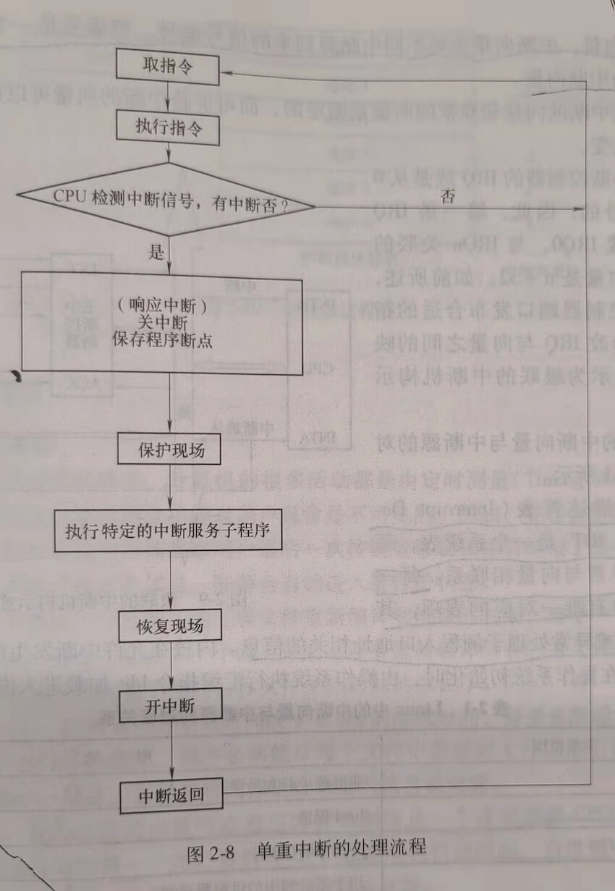

## 第三节 操作系统内核

擦操作系统内核是计算机硬件的第一次扩充，内核执行操作系统与硬件关系密切，执行频率高的模块，常驻内存。

### 1. 支撑功能

支撑功能包括中断处理、时钟管理和原语操作。原语操作也称原子操作，是一组在执行过程中不能被中断的操作。

### 2. 资源管理功能

资源管理包括进程管理、存储器管理和设备管理。

### 一、中断

#### 1. 什么是中断

中断是改变计算机执行指令顺序的一种事件，这样的事件与CPU芯片内外部硬件电路产生的电信号相对应。

计算机在执行程序的过程中，当出现中断时，计算机停止现行程序的运行，转向对这些中断事件的处理，处理结束后再返回到现行程序的间断处。

#### 2. 为什么要中断

引入中断机制后，使CPU可以与其他设备并行工作，能有效得提高CPU的利用率，改善系统性能，支持系统的异步性。

#### 3. 中断的类型

中断分为同步中断（也称内部中断或异常）和异步中断（也称外部中断）两种。

##### 1）同步中断（内部中断或异常）

同步中断是指指令执行时由CPU控制单元产生的，之所以称为同步，是因为只有在一条指令终止执行（注意：此时指令不一定执行完毕）后CPU才会发出中断，如除法出错、调试、溢出和浮点出错等。

##### 2）异步中断（外部中断）

异步中断是由其他硬件设备随机产生的。

外部中断又可分为外部可屏蔽中断和外部不可屏蔽中断。

1）外部可屏蔽中断。外部可屏蔽中断是由I/O设备产生的中断，有两种方式可屏蔽中断。

一是如在 Intel 80x86 的CPU上，把 EFLAGS 寄存器的 IF 标志置0，表示关中断。此时CPU忽略所有的可屏蔽中断。

二是可以对可编程中断控制器（Programmable Interrupt Controller，PIC）编程来禁止中断请求（Interrupt Request，IRQ）。也就是说，可以告诉PIC停止对给定的IRQ线发布中断。

2）外部不可屏蔽中断。外部不可屏蔽中断是由紧急事件引起的中断，如硬件故障。

#### 4. 引起中断的原因

1）人为设置中断。在程序中人为设置中断。

2）程序性事故。例如，计算机出现除数为0.

3）硬件故障。插件接触不良、电源掉电等。

4）I/O设备。I/O设备被启动以后，一旦其准备就绪或完成一次输入/输出，便向CPU发出中断请求。

5）外部事件。如用户通过键盘和鼠标来中断现行程序。

#### 5. 中断响应

1）响应中断的条件

对于可屏蔽中断，开中断是响应中断的前提。例如，在 Intel 80x86 CPU 上，当EFLAGS寄存器的IF标志为1表示开中断。

2）响应中断的时机

对于外部中断，CPU每执行完一条指令都会检测是否有外部中断信号的到来。若有，则转中断处理过程。

#### 6. 单重中断的处理过程

CPU在反复执行指令的过程中，每执行完一条指令，都会检测是否有外部中断信号的到来。如果检测到有中断信号，则转中断处理过程。

1）系统关闭中断，保护断点，把当前要执行的下一条指令的地址保存到内存中，以便中断返回时，能把这个地址恢复到程序计数器PC中，使被中断的程序从断点处开始继续执行。

2）转中断处理程序。在中断处理程序中完成保护现场的工作，就是把相关的硬件上下文信息保存到内存中。硬件上下文就是中断返回恢复被中断程序的执行时，需要写回CPU寄存器的值。

3）保护现场后，要根据中断向量到中断向量表中（在 Linux 中是到中断描述符表中）找到与中断处理子例程入口地址相关的信息，由这些信息得到中断处理子例程的入口地址，以执行中断处理子例程，完成本次中断处理的特殊处理工作。

4）最后，恢复现场，开中断，CPU返回断点处继续执行被中断的程序。

#### 7. 如何找到中断服务子程序

1）中断向量。中断向量是对不同中断源到来的信号编号，该编号是一个无符号整数（0～255），成为中断向量。

2）中断描述符表（Interrupt Descriptor Table，IDT）是一个系统表，每一个中断或异常与向量相联系。每个向量在表中有唯一对应的表项，其中存有与中断或异常处理子例程入口地址相关的信息。

当发生中断时，CPU根据中断号获取中断向量值，再根据中断描述符表的起始地址和中断向量值，得到形成中断服务子程序（中断服务例程）入口地址的相关信息。

### 二、时钟管理

#### 1. 时钟的重要性

操作系统的内核可以利用时钟机制防止一个进程垄断CPU或其他资源。系统可以利用时钟机制限制一个用户进程在CPU上的连续执行的时间，当进程一次连续运行的时间超过限定的时间时，由系统将CPU分配给其他进程。

#### 2. 计算机系统中的时钟

大部分PC中有两个时钟源，分别称为实时时钟（Real Timer Clocker，RTC）和 OS 时钟。RTC时钟也称为 CMOS时钟，是一块时钟芯片，靠电池供电，为计算机提供计时标准，是最原始、最底层的数据。OS时钟产生于PC主板上的定时/计数芯片，在开机时有效，由系统控制。

#### 3. 操作系统的时钟机制

操作系统需要完成的两种系统测量，一是保存当前的日期和时间，以便能通过系统调用把它们返回给用户程序，让用户程序获得当前的日期和时间，也可以由内核本身把当前时间作为文件和网络包的时间戳。二是维持定时器，这种机制能够告诉内核或用户程序某一时间间隔已经过去了。

操作系统依靠时钟硬件（可编程间隔定时器PIT）和时钟驱动程序完成上述两种定时测量功能。

1）OS 时钟管理硬件（可编程间隔定时器PIT）。

2）时钟软件--时钟驱动程序

时钟驱动程序也称为时钟中断处理程序，每产生一次时钟中断信号，操作系统内核要执行时钟驱动程序，时钟驱动程序完成下列功能。

1）维护日期和时间。

2）递减当前进程在一个时间片内剩余执行时间，并检查是否为零，防止进程运行超时。

3）对CPU的使用情况记账。

4）递减报警计数器。

### 三、系统调用

#### 1. 什么是系统调用

系统调用是一群预先定义好的模块，它们提供一条管道让应用程序或一般用户能由此得到核心程序的服务。

系统调用是系统程序与用户程序之间的接口。

#### 2. 系统调用与一般函数的区别

##### 1）用户态执行

用户空间是指用户进程所处的地址空间。一个用户进程不能访问其他用户进程的地址空间，只有系统进程才能访问其他用户地址空间。当CPU执行用户空间的代码时，称该进程在用户态执行。

##### 2）系统态执行

系统空间是指含有一切系统核心代码的地址空间，当CPU执行系统核心代码时，称进程处于系统态执行。

##### 系统调用与一般函数调用的区别如下。

1）系统调用运行在系统态（核心态），而一般函数运行在用户态。

2）系统调用与一般函数调用的执行过程不同。系统调用执行时，当前进程被中断，由系统找相应的系统调用子程序，并在系统态下执行，执行结果返回进程。

3）系统调用要进行“中断处理”，比一般函数调用多了一些系统开销。

#### 5. 系统调用的类型

根据系统调用的功能把系统总结为以下几种类型。

1）进程控制类系统调用。创建、撤销进程；获得、改变进程属性。

2）文件操作类系统调用。创建文件、删除文件、打开文件、关闭文件和读/写文件。

3）设备管理类系统调用。请求、释放设备。

4）通信类系统调用。打开、关闭连接，交换信息。

5）信息维护类系统调用。返回系统当前日期、时间、版本号、用户数、空闲内存和磁盘空间大小等信息。

